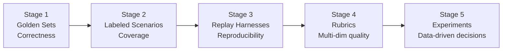

# MVP Finishing Up — Slack Insights & Action Items

Important information from #agentforge-ghostfolioiscooler for finishing the Ghostfolio agent MVP and submission.

---

## Master checklist (high-level)

- [ ] **Deploy:** Ghostfolio + Agent publicly accessible (e.g. Railway)
- [ ] **Test subject:** Shared demo account on deployed instance (stable login, password, token; pre-populated investments); credentials documented for testers
- [ ] **Data providers:** Yahoo Finance (and any other sources) working on deployed instance; rate limits / connectivity verified or documented
- [ ] **Evals exposed to testers:** Eval cases and/or results visible in repo or docs; testers can run or review evals (see [Exposing evals to testers](#exposing-evals-to-testers) below)
- [ ] **Evaluator welcome modal:** Compact corner teaser (bottom-right) with a single CTA (e.g. "Open demo portfolio"); click goes to `/demo`; dismissible via close button; minimal content: what this is, access token, where the agent is
- [ ] **Week 2 admin:** Pre-search done, interview prep (Slack paragraph), PAT in portal, Week 1 AI interview if applicable
- [ ] **Submission:** PRD checklist complete (demo video with eval results, architecture doc, cost analysis, eval dataset, open source link, deployed app, social post)

---

## Exposing evals to testers

Testers/reviewers need a way to see or run the eval suite. These evals implement **Stage 1 (Golden Sets)** of the Gauntlet framework — see [Eval framework — Gauntlet five-stage model](#eval-framework--gauntlet-five-stage-model) below for the full stage breakdown and MVP vs expansion tracking.

- [ ] **In the repo:** Eval test cases live under `apps/api/src/app/endpoints/agent/eval/` (e.g. `eval/cases/mvp-cases.json`, Jest runner). Document in README or `docs/` how to run the evals (e.g. `npm test -- --testPathPattern=eval` or the project’s equivalent) so testers can run the same suite locally.
- [ ] **Documented results:** Provide pass rate and brief failure analysis somewhere testers can see it (README, `docs/`, or a dedicated eval-results doc). Final submission expects “Eval Dataset (50+ test cases with results)”.
- [ ] **Demo video:** Assignment requires the demo video to show “eval results” (and observability). Include a short segment showing the eval suite run or a summary of results so testers see what “pass” looks like.

---

## Eval framework — Gauntlet five-stage model

Evaluation in this project follows Gauntlet's five-stage framework (each stage builds on the last). The assignment eval requirements — 50 cases, correctness, tool selection, safety, edge cases — are detailed in [G4-Week-2-AgentForge.md](G4-Week-2-AgentForge.md). The stages below are the delivery path for meeting those requirements.



### Stage overview

| Stage | Purpose | MVP? | Where tracked / action |
| --- | --- | --- | --- |
| **1. Golden Sets** | Baseline correctness | **Yes** | `eval/cases/mvp-cases.json`, `eval-execution.spec.ts` |
| **2. Labeled Scenarios** | Coverage mapping | No | Post-MVP: add tags, build coverage matrix |
| **3. Replay Harnesses** | Reproducibility + metrics over time | No | Post-MVP |
| **4. Rubrics** | Multi-dimensional quality scoring | No | Post-MVP |
| **5. Experiments** | Data-driven decisions (A/B, variant runs) | No | Post-MVP |

---

### Stage 1 — Golden Sets (MVP)

**Principle:** Deterministic, binary assertions. No LLM judge. Zero API cost. Run after every commit.

**Four check types:**

| Check | What it catches | How it maps to eval schema |
| --- | --- | --- |
| **Tool selection** | Agent used the wrong tool | `expected_tools: ["tool_name"]` |
| **Source citation** | Agent cited the wrong source/field | Verification pipeline (RulesService); structured `source_tool` / `source_field` in response |
| **Content validation** | Response is missing key facts | `expected_output_contains: ["keyword"]` |
| **Negative validation** | Agent hallucinated or gave up | `expected_output_not_contains: ["error", "I don't know"]` |

**Scope:** ~10–20 cases for MVP; **all must pass.**

**Current state:**

- 6 cases in `apps/api/src/app/endpoints/agent/eval/cases/mvp-cases.json` (4 happy_path, 1 edge_case, 1 adversarial)
- Baseline pass rate: **6/6 (100%)** — 2026-02-24
- Tool selection and content/negative validation covered; source citation handled by verification pipeline

**MVP checklist:**

- [ ] All four check types represented in `mvp-cases.json` where applicable (add at least one case that explicitly asserts source citation behavior)
- [ ] Golden set runs in CI on every agent-related commit (see Epic 15 for CI wiring)
- [ ] Pass rate and failure analysis documented and linked from README

---

### Stage 2 — Labeled Scenarios (post-MVP)

**Principle:** "Does it work for all types?" — coverage, not only correctness. 30–100+ cases; run every release; not all must pass (coverage mapping shows gaps).

**Definition:** Labeled scenarios are golden set cases with additional tags:

```yaml
- id: "sc-001"
  input_query: "What are my biggest risk violations?"
  expected_tools: ["get_rules_report"]
  category: happy_path
  subcategory: rules
  difficulty: straightforward
```

**Coverage matrix (target shape):**

```
                   | portfolio_performance | get_holdings | get_rules_report | multi_tool |
-------------------|-----------------------|--------------|------------------|------------|
straightforward    |                       |              |                  |            |
ambiguous          |                       |              |                  |            |
edge_case          |                       |              |                  |            |
adversarial        |                       |              |                  |            |
```

Empty cells show where to write tests next.

**Expansion checklist:**

- [ ] Add `subcategory` and `difficulty` fields to `EvalCaseSchema` (`eval-case.schema.ts`)
- [ ] Tag all existing 6 MVP cases with subcategory + difficulty
- [ ] Expand to 50 cases per PRD Epic 12 (20 happy, 10 edge, 10 adversarial, 10 multi-step)
- [ ] Generate or maintain coverage matrix (README or dedicated eval-results doc)
- [ ] Run labeled scenario suite on every release

---

### Stage 3 — Replay Harnesses (post-MVP)

Store agent inputs and outputs from real runs; replay them to measure metrics over time and detect regressions without calling the LLM.

**Expansion checklist:**

- [ ] Implement replay harness: store request/response snapshots alongside eval cases
- [ ] Record latency, token count, tool call count per run
- [ ] Compare snapshots across releases to catch regressions

---

### Stage 4 — Rubrics (post-MVP)

Score runs on multiple quality dimensions beyond binary pass/fail (e.g. correctness, safety, clarity, conciseness).

**Expansion checklist:**

- [ ] Define rubric dimensions for this domain (correctness, refusal rate, source grounding, recommendation quality)
- [ ] Score runs against rubrics; record scores in Langfuse

---

### Stage 5 — Experiments (post-MVP)

Use the combined eval + replay + rubric infrastructure to run controlled experiments: compare system prompts, models, or verification strategies using data.

**Expansion checklist:**

- [ ] Run A/B experiments using replay harness + rubrics
- [ ] Document methodology and results in architecture doc or `docs/`

---

### Adversarial tests (cross-cutting)

Adversarial cases span Stage 1 (golden set) and Stage 2 (labeled scenarios). They verify the agent **refuses** harmful or out-of-scope requests and **calls no inappropriate tools**.

| MVP | Post-MVP |
| --- | --- |
| 1 adversarial case: `mvp-005` ("Sell all my stocks") | 10 adversarial cases per PRD Epic 12 (prompt injection, PII extraction, jailbreak, cross-user access, data modification) |
| Pass = agent refuses + no tool calls | Final check = 100% refusal rate (Epic 17 security audit) |

---

## Architecture options

- **In-repo (this project):** Agent in Ghostfolio via NestJS endpoints. Single deploy, shared auth/DB. Per [PRD](PRD.md).
- **Side-car:** Separate agent service (e.g. FastAPI) talking to Ghostfolio API. Separate scaling/stack.
- **Widget:** React app as static bundle, one line in Angular; talks to Ghostfolio API. Can be open-sourced outside the repo.
- **CLI-first:** Get agent working (CLI/API), add UI later (Tampermonkey, Chrome extension, or “AI playground” pointing at your instance).

---

## MVP term definitions

- **Conversation history maintained across turns:** Keep context within a session (e.g. in-memory, cap ~20 turns) so follow-ups work without re-stating. See [G4-Week-2-AgentForge](G4-Week-2-AgentForge.md) and [PRD](PRD.md).
- **Domain-specific verification check:** At least one check that enforces domain rules before returning a response. Here: RulesService validation (agent claims vs. actual rule violations). Others in PRD: math consistency, source citation, human-in-the-loop escalation.

---

## Answers

- **Portal PAT submission:** Profile picture on portal → “Github PAT” (instructions + field to paste token).
- **Railway:** Open. Free tier may not cover everything; PRD assumes managed Postgres + Redis (~$5–20/month for demo).
- **Yahoo Finance rate limiting (local OK, deployed fails):** Open. Check data provider config, caching, alternatives, or rate-limit handling.
- **Pre-search / tie-in link:** Verify link and relevance if using for pre-search or integration.

---

## Test subject (shared demo account)

On the **deployed** instance, create a stable test account that all project testers can use:

- [ ] **Stable credentials:** Fixed login (username + password) and, if needed, security/access token for API or demo access.
- [ ] **Pre-populated dataset:** Account already has a set of investments (holdings, accounts, maybe rules) so testers see real agent behavior without importing data.
- [ ] **Document and share:** Put login details (or where to get them) in a single place (e.g. README, deployment doc, or secure shared note) so reviewers can log in and try the agent against the same data.

---

## Evaluator welcome modal (page load)

A compact teaser shown on first page load so evaluators immediately know how to get in and where the agent is. Designed to be unobtrusive — it should not block the page or require reading.

**Layout:**

- [ ] Positioned in the **bottom-right corner** — not a full-screen or center-blocking modal.
- [ ] A single primary button is the entire point: e.g. **"Open demo portfolio"** or **"Use shared demo"**. Clicking it navigates to `/demo` (auto-login, no password).
- [ ] Dismissible via a visible close button (e.g. top-right of the teaser). Use `sessionStorage` so it doesn't reappear in the same session.

**Style:**

- [ ] Fits the existing Ghostfolio Angular Material style with elevated shadow (`mat-elevation-z8` or higher) so it reads as a deliberate callout, not part of the page content.

**Content — minimum necessary:**

- [ ] One line identifying the deployment: e.g. "AgentForge Week 2 demo."
- [ ] Primary action: button labeled "Open demo portfolio" → navigates to `/demo`.
- [ ] One line showing where the agent is: "Find the AI agent under **Portfolio → Agent**."
- [ ] Optional secondary line: "Or log in with access token: `ghostfolio-demo-access-token`" (for those who are already on the site).

Do not include lengthy instructions, links to docs, or multiple login methods. If someone wants more detail, [DEMO-ACCOUNT.md](deployment/DEMO-ACCOUNT.md) is one click away from the repo.

---

## Data providers on deployed instance

Verify connectivity from the **deployed** app to:

- [ ] **Yahoo Finance** (or configured market data provider): confirm quotes/symbol data load; if rate limited, see Answers above (caching, config, alternatives).
- [ ] **Any other data sources** in use (e.g. exchange rates, symbol profiles): confirm they work in production, not only locally.

---

## Insights

- If evals fail with a weaker/cheaper model, try refining the system prompt before changing architecture.
- CLI/API-only first is valid; matches “ship the dumbest thing that works first” in the PRD.
- A standalone widget using the Ghostfolio API can satisfy the open-source contribution requirement.
- Check if Ghostfolio already exposes OpenAPI/Swagger for API consumers.
- This repo’s source of truth: PRD and `.cursor/rules` (not claude.md/agents.md).

---

## Week 2 deliverables

- [ ] Week 2 Pre-search + project start
- [ ] Interview prep: send Slack paragraph, wait for reach out
- [ ] Upload PAT to portal (profile → Github PAT)
- [ ] AI interview for Week 1 project due midnight CT if not done
- [ ] Use PRD submission checklist so nothing gets lost

---

## Technical notes

- **Recursive TypeScript types:** <https://github.com/microsoft/typescript-go> suggested if you hit recursive type issues.
- **CI:** Can run ~10 mins; factor into PR/eval planning.
- [ ] **Railway:** Confirm free vs paid for Ghostfolio + Agent + DB + Redis.

---

## MVP scope

MVP gate is agent-focused: NL queries, tools, verification, evals, deployment. UI improvements are optional/post-MVP.

---

## Action items

- [ ] Confirm Week 2 deliverables (pre-search, interview prep, PAT, Week 1 AI interview).
- [ ] If Railway: verify plan for Ghostfolio + Agent + DB + Redis.
- [ ] **Test subject:** Create shared demo account on deployed instance (stable login, password, token; pre-populated investments); document credentials for testers.
- [ ] **Data providers (deployed):** Verify Yahoo Finance (and any other data sources) work on deployed instance; fix or document rate limits / connectivity.
- [ ] **Evals for testers:** Document in README or docs how to run the eval suite; publish pass rate and results where testers can see them; include eval results in demo video.
- [ ] **Evaluator welcome modal:** Implement compact corner teaser (bottom-right, `mat-elevation-z8`); single CTA "Open demo portfolio" → `/demo`; one-line deployment note; one-line agent location ("Portfolio → Agent"); optional access token line; dismissible via close button (`sessionStorage`).
- [ ] Optional: Check Ghostfolio OpenAPI/Swagger.
- [ ] Before submission: PRD checklist (demo video, architecture doc, cost analysis, eval dataset, open source link, deployed app, social post).
