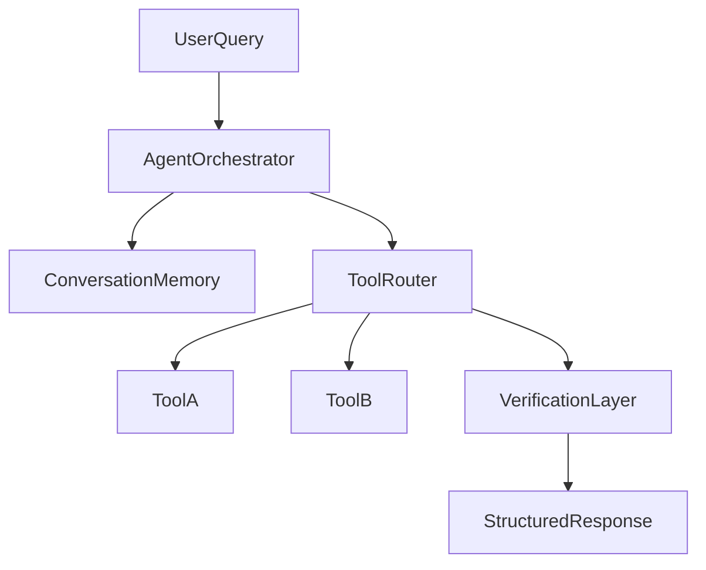

# G4 Week 2 AgentForge - Pre-Search Research Strategy

This document provides a staged, collaborative prompt system to complete the Pre-Search portion of `G4-Week-2-AgentForge.md` for the Ghostfolio domain project.

Use one stage at a time. After each stage, start a new chat/context window and paste the next stage prompt with the previous stage output.

## How To Use This Strategy

1. Start with **Stage 1 Master Prompt** in a fresh chat.
2. Complete that stage collaboratively (Agent + Human decisions).
3. Copy the stage output into the next stage prompt where indicated.
4. Start a new chat/context window for the next stage.
5. Repeat through Stage 5.
6. The final Stage 5 output should become your Pre-Search submission draft.

## Shared Operating Rules (apply to all stages)

- The process is collaborative: the agent proposes, the human decides.
- The agent must pause at decision checkpoints and request confirmation.
- Prefer practical decisions that can be shipped in one week.
- Tie all recommendations to explicit requirements in `G4-Week-2-AgentForge.md`.
- Every stage output must include:
  - Decisions made
  - Trade-offs considered
  - Open questions
  - Inputs required for the next stage

---

## Stage 1 Master Prompt - Domain Recon and Constraint Definition

Paste this in a new chat to start.

```md
You are my AI technical strategist. We are completing the Pre-Search for AgentForge Week 2 in the finance domain using Ghostfolio.

Context:
- Project requirements: `G4-Week-2-AgentForge.md`
- Codebase: `ghostfolio/` (Nx monorepo, NestJS API + Angular client + Prisma/Postgres + Redis)
- Goal: complete Pre-Search phases before coding

Your mission in this stage:
1) Perform domain and codebase reconnaissance.
2) Help define constraints from Phase 1 of the checklist.
3) Produce a structured output we can pass to Stage 2.

Required investigation focus:
- Ghostfolio domain capabilities (portfolio, accounts, transactions, market data, auth, etc.)
- Existing backend modules and API surfaces likely reusable as tools
- Data sources and data model constraints
- Reliability implications in finance domain
- Scale/performance/cost assumptions appropriate for a one-week build

Collaboration rules:
- Ask me targeted questions when decisions are needed.
- Do not finalize architecture or framework choices yet; only shortlist options.
- Keep recommendations implementation-oriented, not generic.

Output format (strict):
1. Domain/use-case shortlist (3-5 candidate use cases, ranked)
2. Constraint definition (Phase 1):
   - Domain selection and scope
   - Scale/performance assumptions
   - Reliability requirements
   - Team/skill constraints (assume solo builder unless I specify otherwise)
3. Codebase reconnaissance summary:
   - Relevant modules/files to leverage
   - Data dependencies
   - Known unknowns
4. Decision checkpoint questions for me (max 5)
5. Stage handoff package for Stage 2:
   - Confirmed decisions
   - Assumptions to carry forward
   - Open risks
```

### Stage 1 Human Checklist

- Approve one primary use case and one backup use case.
- Confirm latency/cost/reliability tolerance assumptions.
- Confirm any personal skill constraints to optimize for.

---

## Stage 2 Continuation Prompt - Architecture and Framework Selection

Start a new chat/context window and paste this with Stage 1 output included.

```md
You are continuing the AgentForge Pre-Search process for Ghostfolio.

This is Stage 2: Architecture Discovery (framework, LLM, tool design).

Prior stage output (Stage 1) is pasted below:
---
[PASTE STAGE 1 OUTPUT HERE]
---

Your mission:
1) Convert Stage 1 constraints into a concrete architecture proposal.
2) Select framework and LLM options with explicit trade-offs.
3) Design the initial tool registry aligned to Ghostfolio capabilities.

Required decisions:
- Agent framework choice (LangChain vs LangGraph vs custom)
- Single-agent vs multi-agent approach
- State/memory strategy for conversation continuity
- LLM selection with cost/latency/function-calling trade-offs
- At least 5 proposed tools with draft schemas

Tool design requirements:
- Each tool should map to a plausible Ghostfolio backend capability.
- For each tool include: purpose, inputs, outputs, failure modes, verification hooks.
- Mark each tool as MVP (first 24h) or Post-MVP.

Collaboration rules:
- Present options, then ask for my confirmation before locking major decisions.
- If multiple viable architectures exist, propose a recommended path plus fallback.
- Keep scope realistic for one-week sprint.

Output format (strict):
1. Proposed architecture (diagram + explanation)
2. Framework decision matrix and recommendation
3. LLM decision matrix and recommendation
4. Tool registry v1 (minimum 5 tools; include MVP tagging)
5. State/memory and orchestration plan
6. Decision checkpoint questions for me (max 5)
7. Stage handoff package for Stage 3:
   - Locked decisions
   - Deferred decisions
   - Risks/assumptions
```

### Mermaid Template For Stage 2

Use this structure if a visual is needed:



---

## Stage 3 Continuation Prompt - Eval, Verification, Observability

Start a new chat/context window and paste this with Stage 2 output included.

```md
You are continuing the AgentForge Pre-Search process for Ghostfolio.

This is Stage 3: Eval framework, verification systems, and observability design.

Prior stage output (Stage 2) is pasted below:
---
[PASTE STAGE 2 OUTPUT HERE]
---

Your mission:
1) Design an eval strategy that meets project requirements.
2) Define verification mechanisms (minimum 3 types).
3) Select observability stack and instrumentation approach.

Hard requirements to satisfy:
- Eval dataset: minimum 50 test cases
  - 20+ happy path
  - 10+ edge cases
  - 10+ adversarial
  - 10+ multi-step reasoning
- Eval dimensions:
  - correctness
  - tool selection
  - tool execution
  - safety
  - consistency
  - edge-case handling
  - latency
- Verification systems: minimum 3
- Observability includes traces, latency, errors, token usage, eval history, feedback loop

Design constraints:
- Must be practical to implement in this codebase/timebox.
- Must support iterative improvement from eval failures.

Collaboration rules:
- Ask me to choose where preferences matter (e.g., LangSmith vs Braintrust vs Langfuse).
- Identify minimal viable setup vs ideal setup.

Output format (strict):
1. Eval framework blueprint
2. 50-case dataset generation plan and schema
3. Verification strategy (3+ checks with thresholds/escalation)
4. Observability stack recommendation and instrumentation points
5. Performance target plan mapped to required metrics
6. Decision checkpoint questions for me (max 5)
7. Stage handoff package for Stage 4
```

---

## Stage 4 Continuation Prompt - Failure Modes, Security, Deployment, Operations

Start a new chat/context window and paste this with Stage 3 output included.

```md
You are continuing the AgentForge Pre-Search process for Ghostfolio.

This is Stage 4: Post-stack refinement (failure modes, security, deployment, ops).

Prior stage output (Stage 3) is pasted below:
---
[PASTE STAGE 3 OUTPUT HERE]
---

Your mission:
1) Perform failure mode analysis across agent + tools + verification.
2) Define security approach for prompt injection, data leakage, and key management.
3) Propose deployment and operations plan (CI/CD, monitoring, rollback).

Required analysis areas:
- Tool failure handling and fallback logic
- Ambiguous query handling strategy
- Rate limits and graceful degradation
- Prompt injection defenses
- Data privacy boundaries and auditability
- Deployment target and release process
- Monitoring/alerting and rollback process

Collaboration rules:
- Keep recommendations aligned to one-week implementation constraints.
- Flag anything that is non-negotiable for safety/reliability.
- Ask me to pick between deployment/tooling alternatives when needed.

Output format (strict):
1. Failure mode matrix (failure -> impact -> detection -> mitigation)
2. Security plan (threats, controls, implementation notes)
3. Deployment/operations architecture and runbook outline
4. CI/CD and regression testing plan
5. Decision checkpoint questions for me (max 5)
6. Stage handoff package for Stage 5
```

---

## Stage 5 Continuation Prompt - Final Pre-Search Synthesis

Start a new chat/context window and paste this with Stage 4 output included.

```md
You are continuing the AgentForge Pre-Search process for Ghostfolio.

This is Stage 5: Synthesis into final Pre-Search strategy and implementation roadmap.

Prior stage output (Stage 4) is pasted below:
---
[PASTE STAGE 4 OUTPUT HERE]
---

Your mission:
1) Consolidate all prior stage decisions into a final Pre-Search output.
2) Ensure all required checklist areas from Phase 1-3 are explicitly addressed.
3) Produce an actionable implementation roadmap for the one-week sprint.

Required outputs:
- Final Pre-Search checklist completion (Phase 1, 2, 3)
- Architectural decisions and tool/service selections
- Trade-off explanations
- Build strategy aligned to milestones (24h MVP, Friday, Final Sunday)
- AI cost analysis assumptions and projection template
- Open-source contribution plan (specific and feasible)
- Remaining open questions and decision log

Collaboration rules:
- If critical decisions remain unresolved, list them clearly and ask me to finalize.
- Keep the final output concise but execution-ready.

Output format (strict):
1. Final Pre-Search Document (submission-ready draft)
2. One-week execution roadmap by milestone
3. Cost analysis assumptions + projection table template
4. Risk register + mitigation summary
5. Final decision log
```

---

## Universal Prompt For Continuing In A New Chat

Use this whenever you open a new chat/context and want continuity:

```md
Continue the AgentForge Week 2 Pre-Search process for Ghostfolio.

We are currently on Stage [N].
Use the stage goals, output format, and constraints defined in `G4-Week-2-AgentForge-Research-strategy.md`.

Here is the complete output from Stage [N-1]:
---
[PASTE PRIOR STAGE OUTPUT HERE]
---

Before proceeding:
1) Summarize inherited decisions and assumptions.
2) List unresolved questions.
3) Execute Stage [N] with collaborative checkpoints.
```

---

## Expected Artifacts By End Of Pre-Search

- Final Pre-Search strategy document covering all checklist phases
- Architecture and tool registry decisions tied to Ghostfolio
- Eval and verification design with measurable targets
- Observability and operations strategy
- Cost assumptions and projection framework
- Open-source contribution path for final submission

This strategy is intentionally stage-gated so each new chat/context starts with clear, reusable inputs and ends with explicit handoff outputs.
